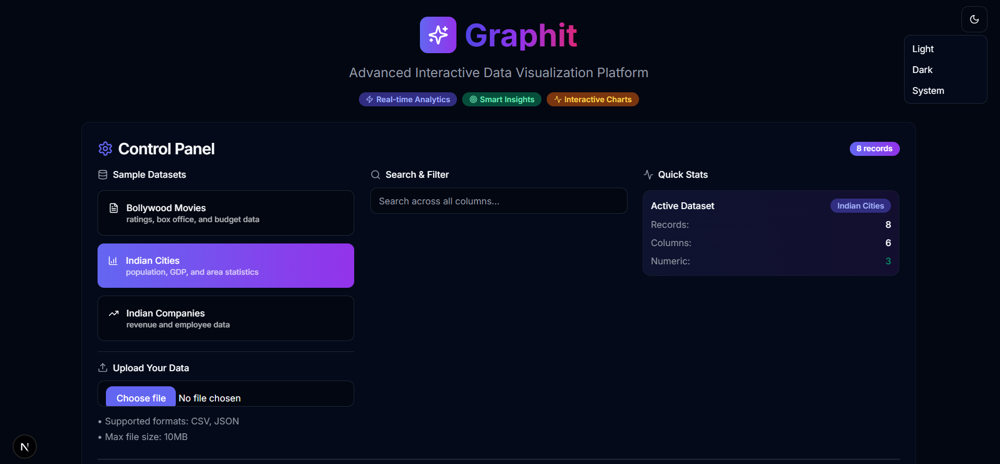
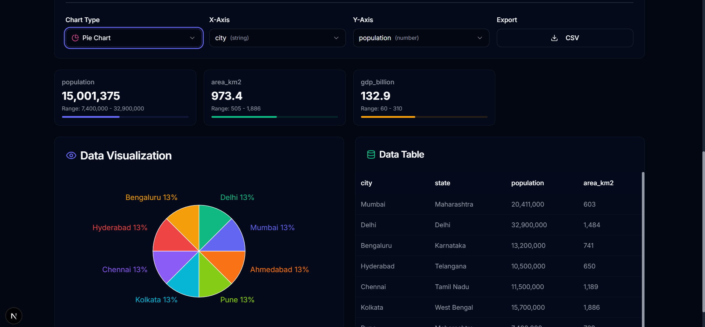

# 📊 Graphit - Advanced Interactive Data Visualization Platform

A modern, responsive web application built with **Next.js 14**, **React**, and **TypeScript** that transforms raw data into beautiful, interactive visualizations. Perfect for data analysts, business professionals, and anyone who needs to quickly explore and understand their data.

### 🚀 **Live Demo**: [graphit](https://graphit-eta.vercel.app/)


## 🎥 Demo

### Screenshot 1: Data Visualization Dashboard  


### Screenshot 2: Interactive Table View  



---
## ✨ Features

### 🎯 **Core Functionality**
- **Multiple Chart Types**: Bar, Line, Area, Pie, and Scatter plots
- **Real-time Data Processing**: Instant filtering, sorting, and searching
- **Smart Axis Selection**: Automatic detection of data types for optimal visualization
- **Interactive Tables**: Sortable columns with detailed record views
- **Data Export**: Export filtered data as CSV files

### 📊 **Sample Datasets**
- **Bollywood Movies**: Top Indian films with ratings, box office, and budget data
- **Indian Cities**: Major cities with population, GDP, and area statistics  
- **Indian Companies**: Leading corporations with revenue and employee data

### 🎨 **Modern UI/UX**
- **Light & Dark Mode**: Seamless theme switching with system preference detection
- **Glassmorphism Design**: Modern glass-like effects with backdrop blur
- **Responsive Layout**: Optimized for desktop, tablet, and mobile devices
- **Professional Color Palette**: Carefully chosen colors for accessibility and aesthetics

### 🔍 **Advanced Analytics**
- **Data Insights Panel**: Real-time statistics and data quality metrics
- **Smart Search**: Global search across all columns with result highlighting
- **Statistical Overview**: Min, max, average calculations for numerical data
- **Data Quality Indicators**: Visual representation of data completeness

## 🚀 Getting Started

### Prerequisites
- Node.js 18+ 
- npm or yarn package manager


## 📁 Project Structure

```
Graphit/
├── app/                    # Next.js 14 App Router
│   ├── globals.css        # Global styles and theme variables
│   ├── layout.tsx         # Root layout with theme provider
│   └── page.tsx           # Main application page
├── components/
│   ├── ui/                # Shadcn/ui components
│   ├── data-explorer      # Main data visualization component
│   ├── theme-provider.tsx # Theme context provider
│   └── theme-toggle.tsx   # Theme switching component
├── public/                # Static assets
└── README.md             # Project documentation
```

## 🛠️ Built With

### **Frontend Framework**
- **[Next.js 14](https://nextjs.org/)** - React framework with App Router
- **[React 18](https://reactjs.org/)** - UI library with latest features
- **[TypeScript](https://www.typescriptlang.org/)** - Type-safe JavaScript

### **UI Components & Styling**
- **[Tailwind CSS](https://tailwindcss.com/)** - Utility-first CSS framework
- **[Shadcn/ui](https://ui.shadcn.com/)** - Modern React component library
- **[Lucide React](https://lucide.dev/)** - Beautiful SVG icons
- **[next-themes](https://github.com/pacocoursey/next-themes)** - Theme management

### **Data Visualization**
- **[Recharts](https://recharts.org/)** - Composable charting library built on React components
- **Custom Data Processing** - Built-in algorithms for filtering, sorting, and aggregation

### **Development Tools**
- **[ESLint](https://eslint.org/)** - Code linting and formatting
- **[Prettier](https://prettier.io/)** - Code formatting
- **[PostCSS](https://postcss.org/)** - CSS processing

## 📊 Supported Data Formats

### **CSV Files**
- Comma-separated values with headers
- Automatic type detection (string/number)
- Support for missing values

### **JSON Files**
- Array of objects format
- Nested object support
- Flexible schema handling

### **Example Data Structure**
```json
[
  {
    "title": "Movie Name",
    "genre": "Drama",
    "rating": 8.4,
    "year": 2016,
    "budget_cr": 70,
    "collection_cr": 2023
  }
]
```

## 🎨 Theme Customization

The application supports extensive theme customization through CSS variables:

```css
:root {
  --background: 250 250 250;    /* Light mode background */
  --foreground: 35 38 47;       /* Light mode text */
  --primary: 99 102 241;        /* Primary brand color */
  --secondary: 244 244 245;     /* Secondary elements */
  /* ... more variables */
}

.dark {
  --background: 35 38 47;       /* Dark mode background */
  --foreground: 250 250 250;    /* Dark mode text */
  /* ... dark mode overrides */
}
```

## 🔧 Configuration

### **Chart Colors**
Customize the chart color palette in \`components/data-explorer.tsx\`:

```typescript
const CHART_COLORS = [
  "#6366F1", // Indigo
  "#10B981", // Emerald
  "#F59E0B", // Amber
  // Add more colors...
]
```

### **Sample Datasets**
Add new sample datasets by extending the \`SAMPLE_DATASETS\` array:

```json
const SAMPLE_DATASETS = [
  {
    name: "Your Dataset",
    data: YOUR_DATA_ARRAY,
    description: "Description of your dataset",
    icon: YourIcon,
  }
]
```

## 📱 Responsive Design

The application is fully responsive with breakpoints:
- **Mobile**: < 768px
- **Tablet**: 768px - 1024px  
- **Desktop**: > 1024px

Key responsive features:
- Collapsible navigation
- Adaptive grid layouts
- Touch-friendly interactions
- Optimized chart sizing

---

⭐ **Star this repository if you found it helpful!**
